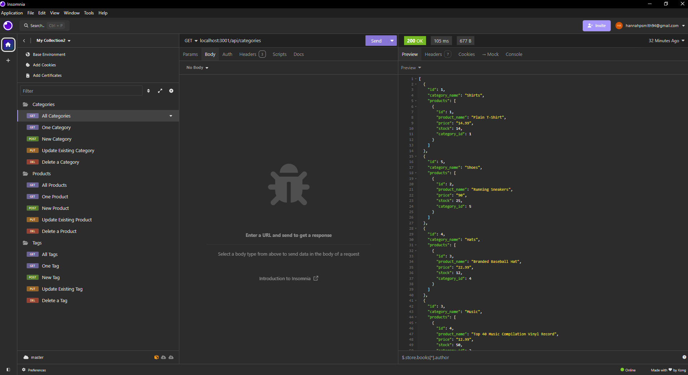

# Amazing E-Commerce

## Description
This project provides a robust back-end solution for e-commerce platforms using modern technologies. Built with Express.js, Sequelize, and PostgreSQL, this back end offers a scalable and efficient way to manage product data, categories, and tags. By implementing a comprehensive API, the project enables seamless interactions between the client-side application and the server, supporting various CRUD operations.

The application is designed to handle complex data relationships, such as product categorization and tagging, through the use of an Object-Relational Mapping (ORM) system. This approach simplifies database interactions, allowing for faster development and easier maintenance. With the increasing reliance on online retail, this back end is an ideal starting point for building scalable and high-performance e-commerce applications.

## Table of Contents
* [Installation](#installation)
* [Usage](#usage)
* [License](#license)
* [Contributing](#contributing)
* [Tests](#tests)
* [Credits](#credits)
* [Questions](#questions)

## Installation
run "npm i" to install dependencies

## Usage
To use this project, first clone the repository and install Node.js and postgreSQL. Create an .env file for your credentials. Sign into postgreSQL to run the schema file. Exit PSQL, run "npm run seed" then "node server.js" to run the server. Once the server is running, you can interact with the API using a tool like Insomnia. The application supports the following RESTful operations: GET/POST/PUT/DELETE.

### Example Requests
* Get all categories: GET /api/categories
* Get a single product by ID: GET /api/products/:id
* Create a new tag: POST /api/tags
* Update a category by ID: PUT /api/categories/:id
* Delete a product by ID: DELETE /api/products/:id

View a demonstration of the application [here](https://drive.google.com/file/d/1OHnpeof0Q-9n3U1hzKzhrveqmrPf5ry-/view?usp=sharing)

## License
This project is licensed under the MIT license. Please feel free to read the license in full detail [here](https://opensource.org/license/mit)

## Contributing
Contact me regarding any contributions to the repo.

## Tests
N/A

## Credits
N/A

## Questions
Please contact me with any additional questions.

Github: hannahpsmith (https://github.com/hannahpsmith)

Email: hannahpsmith94@gmail.com
